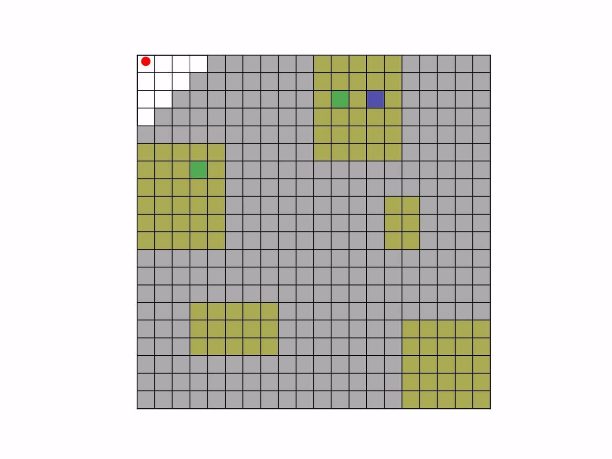

# Temporal-Logic-Aware Frontier-Based Exploration

Code for the paper **[Temporal-Logic-Aware Frontier-Based Exploration](https://arxiv.org/abs/2602.18951)** (Azizollah Taheri & Derya Aksaray, arXiv:2602.18951).

---



---

## Overview

This work addresses motion planning for a robot in an unknown discrete environment under a **syntactically co-safe LTL (scLTL)** task specification, with no prior knowledge of label locations.

The key idea is the notion of **commit states** — DFA states from which certain paths to task satisfaction are permanently foreclosed. The robot avoids entering commit states unless no alternative exploration exists, preventing premature commitments that would make the task unsatisfiable.

Frontiers are scored by:

$$
V(x) = \max_{s_p} \frac{\alpha_1 \cdot I(x) + \alpha_2 \cdot \Omega(s_p)}{W_p(s_p)^{\alpha_3}}
$$

where $I(x)$ is information gain, $W_p(s_p)$ is trajectory cost, and $\Omega(s_p)$ is the task progress metric:

$$
\Omega(s_p) =
\begin{cases}
-\infty & \text{if trajectory reaches trash state} \\
-\dfrac{\alpha_1 \cdot |X|}{\alpha_2} & \text{if trajectory ends in a commit state} \\
\Delta\varphi(s(0), s(f)) & \text{otherwise}
\end{cases}
$$

Paths to frontiers are planned over the **product automaton (TS × DFA)**, not just the physical space, so the robot accounts for task consequences when selecting frontiers.

---

## Repository structure

```
.
├── config.py          # All parameters, map definition, and task formula
├── main.py            # Entry point
├── Helper.py          # Core algorithms (DFA, product automaton, commit states, frontiers)
└── explore_visual.py  # Animation generator (saves explore.mp4)
```

---

## Prerequisites

**Spot** (LTL → DFA translation, not on PyPI):
```bash
conda install -c conda-forge spot
```

**Python packages:**
```bash
pip install numpy networkx matplotlib graphviz
```

**ffmpeg** (for video export):
```bash
sudo apt install ffmpeg   # Ubuntu/Debian
brew install ffmpeg       # macOS
```

---

## Quick start

```bash
python main.py
```

This translates the scLTL formula to a DFA, runs the TL-aware frontier exploration, prints the satisfying trajectory, and saves `explore.mp4`.

---

## Configuration (`config.py`)

| Parameter | Default | Description |
|-----------|---------|-------------|
| `N`, `M` | `20`, `20` | Grid dimensions |
| `H` | `3` | Sensor range (Manhattan distance) |
| `FORMULA_STR` | see file | scLTL task specification |
| `ALPHA1` | `1` | Weight for information gain |
| `ALPHA2` | `20` | Weight for task progress |
| `ALPHA3` | `1` | Trajectory cost exponent |

The default scenario is a **search-and-rescue** task: the robot must locate a person (`p`) and a safe exit (`s`) inside a lower-level region (`d`) that is one-way (commit). The formula is:

```
ϕ = (¬d U (d U (p U ((d∨p) U s)))) ∧ ◇s ∧ (¬s U p)
```

| Proposition | Role | Color |
|-------------|------|-------|
| `d` | lower-level (one-way) region | yellow |
| `p` | person | green |
| `s` | safe exit | blue |

---

## Dependencies

| Library | Purpose |
|---------|---------|
| [Spot](https://spot.lre.epita.fr/) | scLTL → DFA translation |
| NumPy | Array operations |
| NetworkX | Graph/shortest-path algorithms |
| Matplotlib | Animation |
| Graphviz | DFA visualization |
| ffmpeg | Video encoding |
